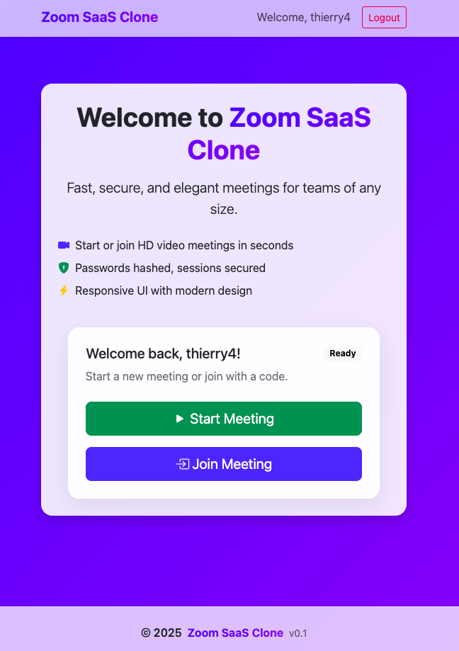
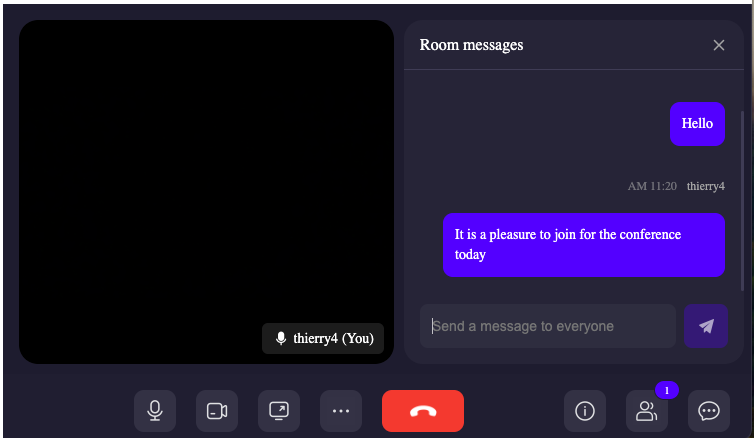
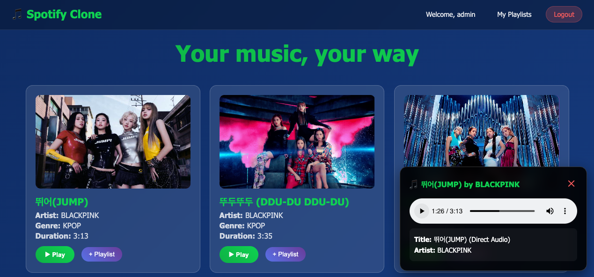
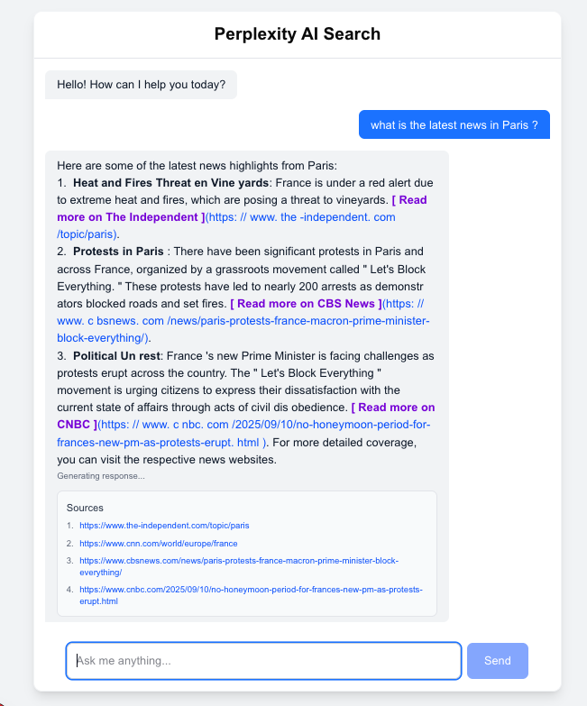

# Automation & DevOps Portfolio

A comprehensive collection of Security Operations Center (SOC) automation tools, infrastructure as code, and full-stack applications demonstrating cybersecurity and DevOps expertise.

## 🛡️ Security Operations & Incident Response

### Ansible Playbooks

- **SOC Operations** (`ansible/playbooks/soc_ops.yml`) - Automated security operations workflows
- **Incident Response** (`playbooks/`) - Automated response playbooks for:
  - Phishing email triage and analysis
  - Suspicious endpoint activity investigation
  - IP blacklisting and threat mitigation
  - User account management and password resets
  - Log collection and forensic analysis

### Python Security Tools

- **Design Patterns for SOC** - Implementation of security-focused design patterns:
  - Singleton pattern for security configurations
  - Factory pattern for alert generation
  - Proxy pattern for secure API access
  - Decorator pattern for audit logging
  - Composite pattern for complex security rules
- **Async Audit System** (`python/async_audit.py`) - High-performance asynchronous audit logging
- **Ownership Restoration** (`use_cases_soc/`) - Automated file ownership recovery after compromise

## 🏗️ Infrastructure as Code

### Terraform Modules

- **AWS EC2** (`terraform/aws_ec2/`) - Secure EC2 instance provisioning
- **OpenStack SOC Environment** (`terraform/openstask/`) - Complete SOC infrastructure:
  - Compute instances with Apache
  - PostgreSQL database clusters
  - Load balancers with SSL termination
  - Network security groups
  - Swift object storage

### Configuration Management

- **Ansible Roles** - Reusable automation for:
  - Ownership restoration after security incidents
  - SOC audit trail generation
  - System hardening and compliance

## 📊 Log Management & Monitoring

### ELK Stack Configuration

- **Elasticsearch, Logstash, Kibana** setup for SOC operations
- **Filebeat** configuration for comprehensive log shipping
- **Custom Kibana dashboards** for incident response overview
- **Automated log collection** playbooks

## 🚀 Web Applications

### Flask SaaS Platform

- **Zoom Clone** (`python_saas/zoom saas 2025 09/`) - Full-featured video meeting application
  - **Technologies**: Python 3.11+, Flask, SQLAlchemy ORM, WebSocket APIs, PostgreSQL, Docker, REST APIs
  - Real-time video conferencing with ZegoCloud SDK
  - User authentication with secure password hashing
  - Session management and room-based meetings
  - Environment variable configuration with python-dotenv
  - PostgreSQL/SQLite database flexibility
  - Meeting room creation and joining functionality

<p align="left">
  
  
</p>


### Django SaaS Platform

- **Spotify Clone** (`python_saas/spotify saas 2025 09/`) - Advanced music streaming application
  - **Technologies**: Python 3.11+, Django 5.2+, SQLite, yt-dlp, AJAX, Bootstrap
  - YouTube audio extraction with yt-dlp for offline playback
  - Smart audio prioritization: direct files > extracted audio > YouTube embeds
  - **Authenticated user features**: Personal playlist creation and management
  - Real-time "Add to Playlist" functionality with modal interface (authenticated users only)
  - User registration, login/logout with secure session management
  - Automatic duplicate prevention in playlists
  - Responsive design with gradient themes and animations
  - Audio file management with Django media handling
  - Search and filtering capabilities for music library
  - Comprehensive error handling and user notifications

<p align="left">
  
</p>

### Fast Api and LangChain Platform

- **Perplexity AI Clone** (`python_saas/perplexity AI-powered chat search engine saas 2025 09/`) - Advanced AI-powered search and chat application
  - **Technologies**: Python 3.11+, FastAPI, Next.js, TypeScript, OpenAI GPT-4o, LangChain, LangGraph
  - Real-time AI-powered search with streaming responses using Server-Sent Events (SSE)
  - **Core Features**: Contextual conversations with memory and state management
  - Automatic source citation and multi-source aggregation via Tavily Search API
  - **Advanced Architecture**: LangGraph-powered conversation flows and tool orchestration
  - Containerized deployment with Docker support

<p align="left">
  
</p>

### TypeScript/Next.js Applications

- **Notion Clone** (`typescript/notion saas git s2025 09/`) - Modern productivity application
  - React-based frontend
  - TypeScript for type safety
  - Modern UI components

## 🔧 DevOps & CI/CD

### GitLab CI/CD

- **Automated pipelines** (`gitlab/pipeline.yml`) with:
  - Security scanning (Bandit, Gitleaks)
  - Code quality checks (flake8, ansible-lint)
  - Infrastructure validation (tfsec, tflint)
  - Multi-environment deployment (dev → preprod → prod)

### Development Tools

- **Regex utilities** for log parsing and data extraction
- **AWS Lambda functions** for serverless SOC operations
- **Argument parsing** for SOC command-line tools

## 🔐 Security Features

- **Environment variable management** - No hardcoded secrets
- **Comprehensive `.gitignore`** - Protects sensitive files
- **Security documentation** - Best practices and guidelines
- **Vault integration** - Secure secrets management
- **Multi-factor authentication** support in applications

## 📁 Repository Structure

```
├── ansible/                    # Configuration management
│   ├── playbooks/             # SOC automation playbooks
│   └── roles/                 # Reusable Ansible roles
├── elasticsearch_logstash_kibana/  # ELK stack configuration
├── gitlab/                    # CI/CD pipeline configuration
├── playbooks/                 # Incident response playbooks
├── python/                    # Security automation scripts
├── python_saas/              # Flask web applications
├── terraform/                # Infrastructure as code
├── typescript/               # TypeScript/React applications
└── use_cases_soc/           # SOC use case implementations
```

## 🚀 Quick Start

### Prerequisites

- Python 3.11+
- Ansible 2.16+
- Terraform 1.0+
- Node.js 18+ (for TypeScript projects)

### Running SOC Playbooks

```bash
# Phishing email analysis
ansible-playbook playbooks/ir_phishing_email.yml -e 'email_file=sample.eml'

# Collect logs from servers
ansible-playbook playbooks/collect_logs.yml -i inventory.ini

# Restore file ownership after compromise
python use_cases_soc/main_ownership_restore_soc.py --owner ubuntu --root /var/www
```

### Infrastructure Deployment

```bash
# Deploy OpenStack SOC environment
cd terraform/openstask/environments/openstack
terraform init
terraform plan
terraform apply
```

### Web Application Setup

```bash
# Flask SaaS platform
cd python_saas/zoom\ saas\ 2025\ 09/
pip install -r requirements.txt
export SECRET_KEY="your-secret-key"
python app.py
```

## 🛡️ Security Considerations

This repository demonstrates enterprise-grade security practices:

- All sensitive data uses environment variables
- Infrastructure follows security best practices
- Automated security scanning in CI/CD
- Comprehensive audit logging
- Incident response automation
